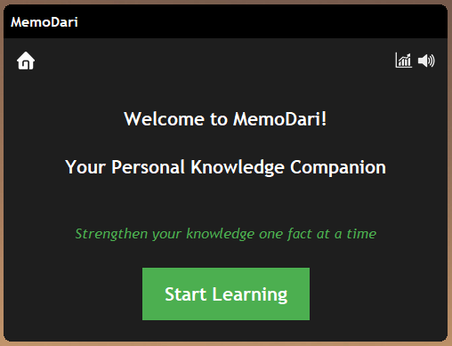
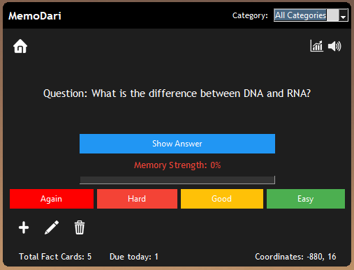

# MemoDari

A feature-rich desktop widget application for learning through flashcards, powered by the Free Spaced Repetition System (FSRS) algorithm. MemoDari can be configured to launch at startup, making it seamlessly integrate into your daily routine.

## Features

- **Smart Flashcard Learning**: Implements FSRS algorithm for optimized learning schedules
- **Rich Analytics Dashboard**: Track your learning progress with detailed visualizations
- **Category & Tag Management**: Organize your cards for better recall
- **Customizable Interface**: Dark theme with persistent window positioning
- **Text-to-Speech**: Audio support for better learning retention
- **Difficulty Tracking**: Monitor stability and difficulty for each card
- **Desktop Widget**: Runs as a desktop widget that can be configured to launch at startup

## Screenshots
*Insert screenshots here - recommended sections:*
1. Main flashcard interface
   
   1.1 Home
   
   <p align="center">
   
   </p>
   
   1.2 Learning UI
   
   <p align="center">
   
   </p>

2. Analytics dashboard
   
   <p align="center">
   
   </p>

3. Card management screen
   
   3.1 Add Card
   
   3.2 Edit Card
   
   3.3 Delete Card

## Installation

1. Clone this repository
2. Install requirements:
   ```
   pip install -r util/requirements.txt
   ```
3. Configure your database settings in `config.py`
4. Run the application:
   ```
   python memodari.py
   ```
5. To set up automatic startup, use the VBS script in the util folder

   For Windows users, you can use the included batch script:
   ```
   util/MemoDari.bat
   ```

## Usage

- **Add Flashcards**: Click the '+' button to create new cards
- **Review Cards**: The application will present cards due for review based on FSRS algorithm
- **Rate Difficulty**: After reviewing a card, rate how difficult it was to recall
- **Track Progress**: Use the analytics tab to monitor your learning journey
wh
## Technical Details

- Built with Python and tkinter for the UI
- SQL Server database backend
- Implements the FSRS algorithm for spaced repetition learning
- Modern UI with responsive design elements

## Future Enhancements

- Cloud synchronization
- Mobile companion app
- Import/export functionality
- User accounts for multi-user support

## License

[MIT License](LICENSE)

---

*Note: MemoDari is a mini-project created for educational purposes.*