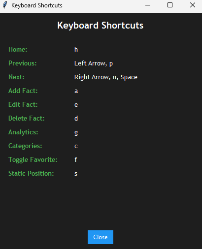
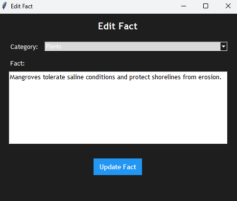
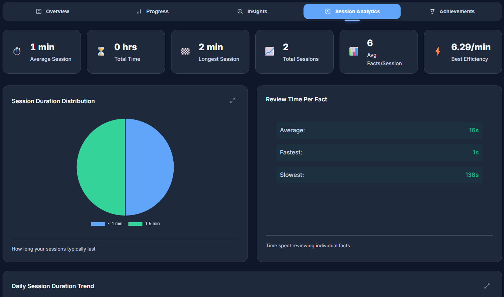
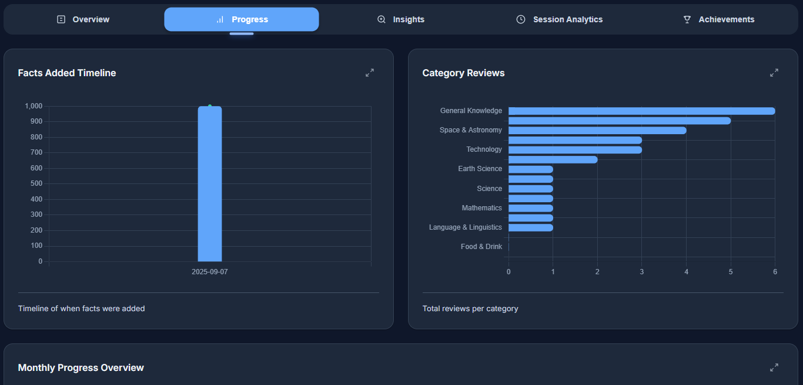
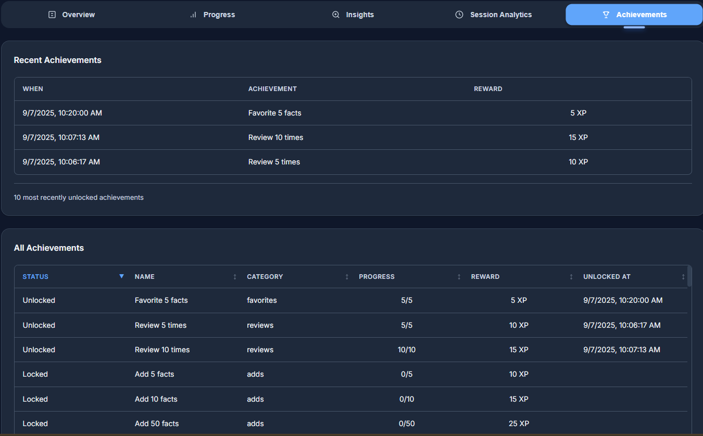

# FactDari

A lightweight desktop widget application for displaying and managing facts, designed to help you learn and review information throughout your day. FactDari sits on your desktop and provides quick access to categorised facts with built-in analytics tracking.

## Features

- **Desktop Widget Interface**: Minimal, always-accessible widget that stays on your desktop
- **Category Management**: Organize facts into categories for better organization
- **Favorites System**: Mark important facts as favorites for quick access
- **Knowledge Tracking**: Mark facts as "Known" or "Not Known" to track your learning progress
- **Review Tracking**: Automatically tracks when and how often you review each fact
- **Text-to-Speech**: Listen to facts with built-in TTS support
- **Analytics Dashboard**: Web-based analytics to visualize your learning patterns
- **Gamification**: XP, levels, daily streaks, and unlockable achievements
- **Navigation Controls**: Easy navigation through facts with previous/next buttons
- **Search & Filter**: Filter facts by category, favorites, or knowledge status
- **Dark Theme**: Eye-friendly dark interface with customizable transparency
- **AI Explanations**: Get AI-powered explanations for any fact using Together AI (DeepSeek model)

## Key Functionality

### Main Application
- View random facts or navigate sequentially through your collection
- Add, edit, and delete facts directly from the widget
- Mark facts as favorites or known/unknown
- Category-based filtering
- Speech synthesis for audio learning
- Automatic review logging
- Click the level text to view achievements
- AI-powered fact explanations with usage tracking

### Analytics Dashboard

The analytics dashboard provides comprehensive visualizations of your learning patterns. All charts and tables are interactive with Chart.js.

| Feature | Description |
|---------|-------------|
| **Overview Tab** | |
| Category Distribution | Pie chart showing facts per category |
| Favorite Categories | Doughnut chart of favorites by category |
| Known Categories | Doughnut chart of known facts by category |
| Categories Viewed Today | Pie chart of today's reviewed categories |
| Knowledge Progress | Doughnut showing known vs unknown ratio |
| Weekly Review Pattern | Radar chart of reviews by day of week (lifetime) |
| Peak Review Hours | Horizontal bar of top 5 active hours (lifetime) |
| Category Growth Trend | Bar chart of lifetime facts per category |
| **Progress Tab** | |
| Facts Added Timeline | Bar + cumulative line of last 10 dates |
| Category Reviews | Horizontal bar of total reviews per category (lifetime) |
| Monthly Progress | Mixed chart of reviews, unique facts, active days (last 6 months) |
| Category Completion Rate | Percentage of facts marked as "known" per category |
| Learning Velocity | Average days from fact creation to marked as "known" |
| Action Breakdown | Pie chart of action types (view, add, edit, delete) |
| Peak Productivity Hours | Session efficiency (facts/min) by hour of day |
| **Insights Tab** | |
| Most Reviewed Facts | Table with medals for top 10 (expandable to all) |
| Least Reviewed Facts | Table with days since last review (expandable) |
| All Favorite Facts | Random 10 favorites table (expandable) |
| All Known Facts | Random 10 known facts table (expandable) |
| Review Activity Heatmap | Hour × Day grid for last 30 days |
| Reviews Per Day | Line chart with unique facts and total reviews (last 30 days) |
| **Session Analytics Tab** | |
| Session Metrics | Cards for avg/total/max duration, session count, facts/session, best efficiency |
| Session Duration Distribution | Pie chart bucketed from < 1min to > 1hr |
| Review Time Per Fact | Stats display (avg/min/max) from ReviewLogs |
| Daily Session Duration | Multi-line trend chart (last 30 days) |
| Category Review Time | Horizontal bar of avg review time by category |
| Session Efficiency | Table of top 100 sessions with facts/min and reviews/min |
| Recent Sessions | Table of last 100 sessions |
| Last 50 Card Reviews | Table of recent reviews (expandable to 500) |
| Timeout Analysis | Combo chart of daily timeout counts and percentage |
| Session Actions | Bar chart and table of add/edit/delete per session |
| **Achievements Tab** | |
| Recent Achievements | Table of last 10 unlocked achievements |
| All Achievements | Badge grid with unlock status, progress bars, filter tabs |
| **AI Usage Tab** | |
| AI Usage Metrics | Cards for total calls, tokens, cost, avg cost, latency, success rate |
| AI Cost Timeline | Bar + cumulative line of daily costs (last 30 days) |
| Token Distribution | Doughnut of input vs output tokens |
| AI Usage by Category | Pie chart of AI calls per fact category |
| AI Usage Trend | Line chart of daily calls and tokens |
| AI Reading Time | Stats display (avg/min/max reading duration) |
| API Latency Distribution | Pie chart bucketed from < 0.5s to > 5s |
| AI Provider Comparison | Table comparing providers by cost, latency, success rate |
| Most Explained Facts | Table of top 10 facts by AI call count |
| Recent AI Usage Log | Table of last 50 AI API calls with model details |
| **Global Features** | |
| XP Progress Bar | Visual level progression with XP breakdown |
| Key Metrics | Cards for total facts, viewed today, streak, categories, favorites, known |
| Lifetime Stats | Cards for facts added/edited/deleted, total reviews, current/best streak |
| Currency Toggle | USD/GBP conversion for all AI cost displays |
| Auto-Refresh | Data refreshes every 5 minutes with countdown timer |
| Metric Info Icons | Clickable info buttons on metric cards showing descriptions and SQL formulas |

### Metric Info Icons

All metric cards across the dashboard feature an information icon (ℹ️) that opens a modal with:
- **Description**: Plain-English explanation of what the metric measures
- **Formula**: The SQL query or calculation used to derive the value

Available on:
- **Key Metrics**: Total Facts, Viewed Today, Review Streak, Categories, Favorites, Known Facts
- **Lifetime Stats**: Facts Added, Facts Edited, Facts Deleted, Total Reviews, Day Streak
- **Session Metrics**: Average Session, Total Time, Longest Session, Total Sessions, Avg Facts/Session, Best Efficiency
- **AI Usage Metrics**: Total AI Calls, Total Tokens, Total Cost, Avg Cost/Call, Avg Latency, Success Rate

## Installation

1. Clone this repository
2. Install required Python packages:
   ```
   pip install -r util/requirements_factdari.txt
   ```
3. Set up the SQL Server database using the script in `database_setup/factdari_setup.sql`
4. Configure your database connection in `config.py`
5. (Optional) Set your Together AI API key for AI explanations:
   ```
   # Windows (PowerShell)
   $env:FACTDARI_TOGETHER_API_KEY = "your-api-key"
   # Or set permanently via System Environment Variables
   ```
6. Run the application:
   ```
   python factdari.py
   ```

## Usage

### Main Widget
- **Home Page**: Shows statistics and quick actions
- **View Facts**: Click "Show Random Fact" or use navigation arrows
- **Add Facts**: Click the "+" button to add new facts
- **Edit/Delete**: Use the edit and delete buttons when viewing a fact
- **Mark Favorite**: Toggle the star icon to mark/unmark favorites
- **Mark Known**: Use the checkmark to track your knowledge progress
- **Filter**: Use the category dropdown to filter facts
- **Listen**: Click the speaker icon for text-to-speech
- **AI Explain**: Click the AI icon (or press `x`) to get an AI-generated explanation of the current fact

### Keyboard Shortcuts

| Key | Action |
|-----|--------|
| `h` | Go to Home page |
| `r` | Start Reviewing |
| `←` / `p` | Previous fact |
| `→` / `n` / `Space` | Next fact |
| `a` | Add new fact |
| `e` | Edit current fact |
| `d` | Delete current fact |
| `f` | Toggle favorite |
| `k` | Toggle known/easy |
| `x` | AI explain fact |
| `v` | Speak fact (TTS) |
| `g` | Open Analytics |
| `c` | Manage Categories |
| `l` | View Achievements |
| `i` | Show Shortcuts |
| `s` | Set static position |

### Analytics
- Run the analytics server:
  ```
  python analytics_factdari.py
  ```
- Open your browser to `http://localhost:5000`
- View comprehensive statistics about your fact review patterns

## Screenshots

Below are sample screenshots of the desktop widget and the analytics dashboard. Image files live in `Resources/application_images`.

### Desktop Widget

- Home Page
  
  
  
  A compact welcome screen with brand header, quick stats (e.g., total facts, seen today), and a clear “Start Reviewing” call‑to‑action.

- Main Fact Window
  
  
  
  The primary viewing interface showing a random fact with previous/next navigation, favorite and known toggles, text‑to‑speech, category filter, and live stats.

- Keyboard Shortcuts
  
  
  
  A quick reference to keyboard controls (e.g., ←/→ for navigation, Space for next, A/E/D for add/edit/delete, F for favorite, K for known).

- Add New Fact
  
  
  
  Dialog to add a new fact with category selection and content box. Includes duplicate prevention and “Save & Add Another” for rapid entry.

- Update Fact
  
  
  
  Edit an existing fact’s text or category. Editing is paused from timing; upon close, the review timer resumes.

- Delete Fact Confirmation
  
  
  
  Confirmation prompt before deleting a fact. The app logs a delete action snapshot and updates session counters.

### Analytics Dashboard

- Overview
  
  
  
  High‑level summary: category distribution, daily review activity, favorites/known totals, and quick KPIs for a fast health check.

- Insights
  
  
  
  Deeper patterns: weekly review radar, top review hours, known vs. unknown ratio, and category growth to spot trends.

- Session
  
  
  
  Session analytics: duration stats, duration distribution, facts/reviews per minute, recent sessions, and last card reviews.

- Progress
  
  
  
  Progress over time: monthly reviews/unique facts/active days with a combined chart, and facts‑added timeline for growth.

- Achievements

  

  Achievement catalog with unlock status, thresholds, rewards, and recent unlocks—mirrors in‑app achievements UI.

- AI Usage

  

  AI analytics dashboard showing total API calls, token usage (input/output), cost tracking over time, latency distribution, most explained facts, and recent usage log with model details.

### Startup Configuration
For Windows users, use the VBS script to configure automatic startup:
```
util/RunFactDari.vbs
```

## Technical Details

- **Frontend**: Python tkinter for the desktop widget
- **Backend**: SQL Server database for fact storage
- **Analytics**: Flask web server with Chart.js visualizations
- **Speech**: pyttsx3 for text-to-speech functionality
- **AI**: Together AI API with DeepSeek-V3.1 model for fact explanations
- **Configuration**: Centralized config.py for all settings
- **Gamification**: SQL-backed XP/levels, daily streak tracking, and achievements (see `gamification.py`)

## Database Schema

- **Categories**: Manages categories for facts (active flag + metadata)
- **Facts**: Stores fact content, category link, global view counts, and computed content key for duplicate prevention
- **ProfileFacts**: Per-profile fact state (personal review count, favorite flag, known/easy flag, last viewed date)
- **ReviewSessions**: Tracks review sessions (start/end, duration, timeout flag, per-session action counters)
- **ReviewLogs**: One row per view/action (per-view duration, optional session link, action type, content snapshots for deleted facts)
- **GamificationProfile**: Single-row profile for XP, level, streaks, lifetime counters, and AI usage totals
- **Achievements**: Catalog of unlockable achievements (code, category, threshold, reward XP)
- **AchievementUnlocks**: Records which achievements have been unlocked (with notification flag)
- **AIUsageLogs**: Tracks AI explanation requests (tokens, cost, latency, status, model/provider, reading duration)

## Configuration

Edit `config.py` to customize:
- Database connection settings
- Database driver override via `FACTDARI_DB_DRIVER` (e.g., `ODBC Driver 17 for SQL Server` or `ODBC Driver 18 for SQL Server`)
- With ODBC 18, you may also need:
  - `FACTDARI_DB_ENCRYPT` (e.g., `yes`/`no`)
  - `FACTDARI_DB_TRUST_CERT` (e.g., `yes` if using local/dev without a trusted cert)
- Window dimensions and positioning
- Color schemes
- Font settings
- UI element sizes
- Inactivity timeout behavior
- XP reward tuning

### Inactivity Timeout
- `FACTDARI_IDLE_TIMEOUT_SECONDS` (default: `300`): seconds of no input before the app considers you idle.
- `FACTDARI_IDLE_END_SESSION` (default: `true`): when idle, end the active session as timed out. If set to `false`, only the current fact view is finalized as timed out and the session remains open.

### XP Rewards
- `FACTDARI_XP_REVIEW_BASE` (default: `1`): base XP per completed view
- `FACTDARI_XP_REVIEW_GRACE_SECONDS` (default: `2`): seconds before counting a view
- `FACTDARI_XP_REVIEW_BONUS_STEP_SECONDS` (default: `5`): +1 XP per step beyond grace
- `FACTDARI_XP_REVIEW_BONUS_CAP` (default: `5`): max time-based bonus
- `FACTDARI_XP_FAVORITE` (default: `1`), `FACTDARI_XP_KNOWN` (default: `10`), `FACTDARI_XP_ADD` (default: `2`), `FACTDARI_XP_EDIT` (default: `1`), `FACTDARI_XP_DELETE` (default: `0`)
- `FACTDARI_XP_DAILY_CHECKIN` (default: `2`): XP on daily streak check-in

### AI Configuration
- `FACTDARI_TOGETHER_API_KEY` or `TOGETHER_API_KEY` or `TOGETHER_API_TOKEN`: Your Together AI API key (required for AI explanations)
- The AI feature uses the DeepSeek-V3.1 model via Together AI
- Cost tracking is automatic based on token usage
- All AI usage is logged to the `AIUsageLogs` table for analytics

### Leveling Configuration
- `FACTDARI_LEVEL_TOTAL_XP_L100` (default: `1000000`): total XP to reach Level 100
- `FACTDARI_LEVEL_BAND1_END` (default: `4`): last level of band 1
- `FACTDARI_LEVEL_BAND1_STEP` (default: `100`): XP per level for band 1
- `FACTDARI_LEVEL_BAND2_END` (default: `9`): last level of band 2
- `FACTDARI_LEVEL_BAND2_STEP` (default: `500`): XP per level for band 2
- `FACTDARI_LEVEL_BAND3_END` (default: `14`): last level of band 3
- `FACTDARI_LEVEL_BAND3_STEP` (default: `1000`): XP per level for band 3
- `FACTDARI_LEVEL_BAND4_END` (default: `19`): last level of band 4
- `FACTDARI_LEVEL_BAND4_STEP` (default: `5000`): XP per level for band 4
- `FACTDARI_LEVEL_CONST_END` (default: `98`): end level of the constant step band (start is `BAND4_END+1`; final step is at 99)

## How XP Works

- Per-view reviews: Awards XP when you finish viewing a fact and move away or the view is finalized by inactivity.
  - Base: +1 XP after a short grace (default 2s).
  - Time bonus: +1 for each additional step (default 5s) after grace, capped (default +5).
  - Max per view with defaults: 6 XP (1 base + 5 bonus).
- Daily check-in: The first time you start a reviewing session on a new day, you gain daily XP (default +2) and the app evaluates streak achievements (3, 7, 14, 30, 60, 90, 180, 365 days).
- Actions: Small XP for common actions.
  - Favorite (mark ON): +1 XP (default).
  - Known (mark ON): +10 XP (default).
  - Add fact: +2 XP (default).
  - Edit fact: +1 XP (default).
  - Delete fact: +0 XP (default).
  - Note: These award when toggled/triggered; they are not 'first-time only' by default.
- Achievements: Unlock thresholds grant additional XP automatically across categories (known, favorites, reviews, adds, edits, deletes, streak). If you jump past multiple thresholds, you receive all applicable rewards.
- Leveling:
  - Level step sizes are designed to total exactly 1,000,000 XP at Level 100 (configurable via env):
    - Level 1-4: +100 XP per level (FACTDARI_LEVEL_BAND1_STEP)
    - Level 5-9: +500 XP per level (FACTDARI_LEVEL_BAND2_STEP)
    - Level 10-14: +1000 XP per level (FACTDARI_LEVEL_BAND3_STEP)
    - Level 15-19: +5000 XP per level (FACTDARI_LEVEL_BAND4_STEP)
    - Level 20-98: constant step automatically fitted so that the total is exactly `FACTDARI_LEVEL_TOTAL_XP_L100`
    - Level 99->100: final step equals the exact remainder to hit the target total
  - Level 100 is gated - your stored Level stays at 99 until all achievements are unlocked, even if you meet the XP target.

All values are configurable via environment variables listed in "XP Rewards" above.
## Making This Repo Public

Before making the repository public:

- Hide local environment folders:
  - A `.gitignore` has been added to exclude `.venv/`, `__pycache__/`, editor folders, etc. If `.venv/` was already committed, untrack it with:
    - `git rm -r --cached .venv`
    - `git commit -m "chore: stop tracking .venv"`
- Database host defaults:
  - Default DB server changed to `localhost\SQLEXPRESS`. Set environment variables to point to your own SQL Server if different.
- Email privacy:
  - Your past commits may include your email in Git metadata. Consider enabling GitHub email privacy and using your noreply address for future commits.
- Assets and licenses:
  - Ensure all images in `Resources/` are yours or properly licensed.
- Debug mode:
  - `analytics_factdari.py` runs the Flask app in debug for local use. Do not expose this publicly.

## Requirements

- Python 3.7+
- SQL Server (or SQL Server Express)
- Windows OS (for desktop widget functionality)
- Required Python packages (see requirements_factdari.txt)

## Testing

The project includes a comprehensive test suite using pytest.

### Running Tests

```bash
# Install test dependencies
pip install pytest pytest-cov pytest-mock

# Run all tests
pytest

# Run with verbose output
pytest -v

# Run specific test file
pytest tests/test_config.py

# Run specific test class
pytest tests/test_gamification.py::TestLevelCalculation

# Run with coverage report
pytest --cov=. --cov-report=html

# Run only fast tests (exclude slow/integration tests)
pytest -m "not slow and not integration"
```

### Test Structure

```
tests/
├── __init__.py           # Test package init
├── conftest.py           # Shared fixtures and configuration
├── test_config.py        # Tests for config.py
├── test_gamification.py  # Tests for gamification.py
├── test_analytics.py     # Tests for analytics_factdari.py
└── test_factdari.py      # Tests for factdari.py helpers
```

### Test Categories

- **Unit Tests**: Test individual functions and methods in isolation
- **Integration Tests**: Test database interactions (marked with `@pytest.mark.integration`)
- **UI Tests**: Test tkinter UI components (marked with `@pytest.mark.ui`)

## License

[MIT License](LICENSE)

---

*FactDari - Your daily companion for fact-based learning*
